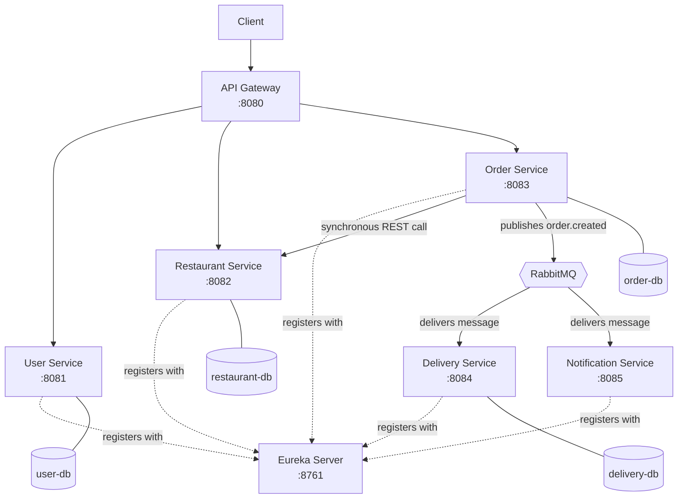

# Food Delivery Microservices System

Project for the **Distributed Information Systems** course - a microservices-based food ordering system built with Spring Cloud, featuring both synchronous and asynchronous inter-service communication, fully containerized with Docker.

---

## 1. Technology Stack

| Category | Technology |
|---|---|
| **Backend** | Java 17, Spring Boot 4.1.1 |
| **Microservices Support** | Spring Cloud (Netflix Eureka, Spring Cloud Gateway) |
| **Database** | PostgreSQL - each service owns its dedicated database (Database-per-Service pattern) |
| **Messaging** | RabbitMQ (topic exchange) |
| **Testing** | JUnit 5, Mockito, H2 (in-memory test database) |
| **Containerization** | Docker & Docker Compose |
| **Build Tool** | Maven |

> **Database isolation:** Each microservice that requires persistence maintains its own dedicated PostgreSQL database (`userdb`, `restaurantdb`, `orderdb`, `deliverydb`), in accordance with the Database-per-Service pattern. Notification Service does not persist data - it keeps notifications in memory for demonstration purposes.

---

## 2. Project Description & Business Logic

This project is a distributed microservices system for managing a food delivery platform, developed as part of a Master's degree curriculum. The system follows a microservice architecture where each service handles a specific business domain.

### Core Business Logic

- **User Management:** Handles basic user registration and retrieval. A simple CRUD service with no dependencies on other services.
- **Restaurant & Menu Management:** Manages restaurants and their menu items. Each restaurant has a list of menu items, linked through a JPA `@OneToMany`/`@ManyToOne` relationship. Exposes an endpoint to retrieve a single menu item, which is consumed by the Order Service during order validation.
- **Order Processing:** When a user creates an order, the Order Service synchronously calls the Restaurant Service (via REST, using Eureka/LoadBalancer for service discovery) to verify that the menu item exists and to retrieve its current price - the price is never trusted from the client. The total order price is calculated server-side, and the order is persisted with a "snapshot" of the item name and price at order time. If the menu item does not exist, the order is rejected with `400 Bad Request`.
- **Asynchronous Notifications & Delivery Assignment:** Once an order is successfully created, the Order Service publishes an `order.created` event to RabbitMQ. Both the Delivery Service and the Notification Service independently consume this event - the Delivery Service assigns a courier (simulated, randomly selected from a fixed list) and the Notification Service records a confirmation notification - without the Order Service being aware of either consumer.

### Infrastructure Components

- **Eureka Server:** All business services register here for service discovery.
- **API Gateway:** The single entry point for client requests, routing them to the appropriate service via Eureka.
- **RabbitMQ:** Message broker used for asynchronous communication between the Order Service and its downstream consumers.

---

## 3. Microservices Architecture

### System Flow

1. **Client** → **API Gateway** (port `8080`)
2. **API Gateway** → **Service Discovery (Eureka)** to resolve service instances
3. **Order Service** *(Synchronous)* → **Restaurant Service**, via a `@LoadBalanced` REST client, to validate the menu item and retrieve its price
4. **Order Service** *(Asynchronous)* → **RabbitMQ Exchange** → **Delivery Service** + **Notification Service**, consumed independently by each

### Architecture Diagram



---

## 4. Messaging Schema (RabbitMQ)

Communication between the Order Service and its consumers is fully asynchronous - the client receives an order confirmation immediately, without waiting for delivery assignment or notification dispatch to complete.

| Property | Value |
|---|---|
| **Exchange** | `order.exchange` (topic) |
| **Routing Key** | `order.created` |
| **Consumer Queues** | `delivery.queue`, `notification.queue` |
| **Payload** | `OrderCreatedEvent` DTO (`orderId`, `userId`, `restaurantId`) |

Both consumer services bind their own queue to the same exchange with the same routing key, receiving independent copies of every event - neither consumer is aware of the other, and neither is aware that the Order Service is the publisher.

---

## 5. API Documentation

> **Note:** Requests can be sent either directly to each service's port, or through the API Gateway at `http://localhost:8080` (routes are prefixed with the service name, e.g. `http://localhost:8080/user-service/api/users`).

### 5.1 User Service (`:8081`)

| Endpoint | Method | Description |
|---|---|---|
| `/api/users` | `GET` | Retrieve all users |
| `/api/users/{id}` | `GET` | Get a user by ID |
| `/api/users` | `POST` | Create a new user |

### 5.2 Restaurant Service (`:8082`)

| Endpoint | Method | Description |
|---|---|---|
| `/api/restaurants` | `GET` | Retrieve all restaurants |
| `/api/restaurants/{id}` | `GET` | Get a restaurant by ID |
| `/api/restaurants` | `POST` | Create a new restaurant |
| `/api/restaurants/{restaurantId}/menu-items` | `GET` | Get all menu items for a restaurant |
| `/api/restaurants/{restaurantId}/menu-items/{itemId}` | `GET` | Get a single menu item (used internally by Order Service) |
| `/api/restaurants/{restaurantId}/menu-items` | `POST` | Add a menu item to a restaurant |

### 5.3 Order Service (`:8083`)

| Endpoint | Method | Description |
|---|---|---|
| `/api/orders` | `POST` | Create a new order - validates items against Restaurant Service, calculates total price, persists the order, and publishes an `order.created` event |
| `/api/orders` | `GET` | Retrieve all orders |
| `/api/orders/{id}` | `GET` | Get an order by ID |

### 5.4 Delivery Service (`:8084`)

| Endpoint | Method | Description |
|---|---|---|
| `/api/deliveries` | `GET` | Retrieve all delivery records |
| `/api/deliveries/order/{orderId}` | `GET` | Get the delivery record for a specific order |

### 5.5 Notification Service (`:8085`)

| Endpoint | Method | Description |
|---|---|---|
| `/api/notifications` | `GET` | Retrieve all notifications recorded since service startup |

---

## 6. Deployment Guide

### Prerequisites

To run this system, you only need **Docker Desktop** installed on your machine. Java, Maven, and PostgreSQL do not need to be installed locally - everything is containerized.

### Startup Procedure

From the project root, run:

```bash
docker compose up --build -d
```

This builds a Docker image for each of the 7 services (multi-stage build - see Section 7) and starts all containers, including PostgreSQL databases and RabbitMQ, on a shared Docker network. Services communicate with each other using their container names (e.g. `restaurant-service`, `eureka-server`) instead of `localhost`.

Allow ~20-30 seconds after startup for all services to register with Eureka before sending requests.

### Verification

```bash
docker compose ps
```

All containers should show status `Up`.

### Service Ports

| Service | Port |
|---|---|
| Eureka Dashboard | `http://localhost:8761` |
| API Gateway | `http://localhost:8080` |
| User Service | `http://localhost:8081` |
| Restaurant Service | `http://localhost:8082` |
| Order Service | `http://localhost:8083` |
| Delivery Service | `http://localhost:8084` |
| Notification Service | `http://localhost:8085` |
| RabbitMQ Management UI | `http://localhost:15672` (guest/guest) |

### Shutdown

```bash
docker compose down
```

---

## 7. Build / Test / Deploy Pipeline

The project defines a clear, repeatable pipeline for building, testing, and deploying the system. At this stage, the pipeline is executed manually via Maven and Docker commands rather than through an automated CI/CD tool (e.g. GitHub Actions) - automating it on a CI/CD platform is listed as an optional enhancement in the assignment specification and was not implemented for this submission.

### Pipeline Overview

```text
Developer machine
        │
        ▼
┌───────────────────────────────┐
│   1. Build                    │
│   - mvn package (per service) │
│   - Docker multi-stage build  │
└───────────────────────────────┘
        │
        ▼
┌───────────────────────────────┐
│   2. Test                     │
│   - mvn test (per service)    │
│   - H2 in-memory database     │
│   - Mocked external calls     │
└───────────────────────────────┘
        │
        ▼
┌───────────────────────────────┐
│   3. Deploy                   │
│   - docker compose up --build │
│   - Shared Docker network     │
│   - Eureka registration       │
└───────────────────────────────┘
```

### 1. Build Phase

Each of the 7 services has its own `Dockerfile` using a **multi-stage build**:

```dockerfile
FROM maven:3.9-eclipse-temurin-17 AS build
WORKDIR /app
COPY pom.xml .
RUN mvn dependency:go-offline -B
COPY src ./src
RUN mvn package -DskipTests -B

FROM eclipse-temurin:17-jre-alpine
WORKDIR /app
COPY --from=build /app/target/*.jar app.jar
EXPOSE <port>
ENTRYPOINT ["java", "-jar", "app.jar"]
```

The build stage compiles the source code using a full Maven + JDK image; the final stage copies only the resulting `.jar` into a minimal JRE-only image, keeping the runtime image small.

### 2. Test Phase

Tests are run independently of the Docker build (`-DskipTests` is used during image build to keep it fast):

```bash
cd <service-name>
mvn test
```

Each service uses a dedicated `test` Spring profile with an H2 in-memory database and mocked external dependencies, so tests do not require Docker, PostgreSQL, RabbitMQ, or Eureka to be running.

### 3. Deploy Phase

Deployment is handled by Docker Compose, which builds all 7 service images and starts them together with PostgreSQL and RabbitMQ on a shared network:

```bash
docker compose up --build -d
```

`depends_on` is used to control startup order (databases and message broker before business services), though it only guarantees that a container has *started*, not that the application inside is *ready* - a known limitation also discussed in Section 9 below.

### Environments

- **Local development:** services can be run individually from the IDE, using the default `application.properties` profile (`localhost`-based connections to services started via Docker or locally).
- **Containerized ("docker" profile):** activated via `SPRING_PROFILES_ACTIVE=docker` and `application-docker.properties`, using Docker Compose service names instead of `localhost` for inter-service communication.

---

## 8. Testing Strategy

The system is tested at two levels for each business service (User, Restaurant, Order, Delivery, Notification):

1. **Unit Tests** - isolated business logic in controllers and services, using Mockito to mock repository, REST client (`RestaurantServiceClient`), and messaging (`RabbitTemplate`) dependencies. This includes behavior verification (e.g. confirming that an event is published) in addition to return-value assertions.
2. **Integration Tests** - controller and database communication tested within a running Spring context (`@SpringBootTest`, `webEnvironment = RANDOM_PORT`) using `TestRestTemplate` against a real HTTP server, backed by an H2 in-memory database (`@ActiveProfiles("test")`) instead of PostgreSQL. External dependencies that would otherwise require a running Docker environment (Restaurant Service calls, RabbitMQ) are replaced with `@MockitoBean` mocks, so tests run independently of Docker.

Running tests for a single service:

```bash
cd <service-name>
mvn test
```

---

## 9. Challenges & Lessons Learned

### Spring Boot 4 package restructuring

This project uses Spring Boot 4.1.1, a very recent release with significant internal package reorganization compared to Spring Boot 3.x. Several classes commonly referenced in tutorials and documentation have moved or been renamed:

- `Jackson2JsonMessageConverter` (RabbitMQ) → `JacksonJsonMessageConverter`
- `TestRestTemplate` moved to a separate `spring-boot-resttestclient` artifact, requiring an explicit `@AutoConfigureTestRestTemplate` annotation (auto-configuration is no longer automatic in `@SpringBootTest`)
- `@MockBean` / `@SpyBean` removed in favor of `@MockitoBean` / `@MockitoSpyBean`
- Spring Cloud Gateway now ships both a reactive (WebFlux) and a servlet-based (MVC) variant with different property prefixes (`spring.cloud.gateway.server.webflux.routes` vs. the classic `spring.cloud.gateway.routes`), which caused early routing failures until the correct variant and prefix were identified.

### Eureka's eventual consistency

Eureka clients cache the service registry locally and refresh it on a fixed interval (~30s). Immediately after restarting a service, dependent services may briefly fail to resolve it (`No instances available for <service>`), even though registration succeeded. This is expected behavior, not a bug, and is mitigated in development simply by waiting a short period after a restart before issuing requests.

### Bean resolution conflicts with `@LoadBalanced`

Declaring a single `@LoadBalanced RestClient.Builder` bean caused Eureka's internal HTTP client (which also autowires a generic `RestClient.Builder`) to unintentionally pick up the load-balanced bean, breaking Eureka's own registration calls. This was resolved by declaring a second, `@Primary`, non-load-balanced builder bean, so that unqualified injections (like Eureka's) receive the plain client, while explicitly `@Qualifier`-annotated injections receive the load-balanced one.

### Docker container-to-container name resolution

Running services with individual `docker run` commands (rather than Docker Compose) does not place them on a shared, DNS-aware network - services registered in Eureka under their container ID, which is not resolvable from other containers. Switching to Docker Compose solved this: it automatically creates a shared network where each service is reachable by its Compose service name.

### `BigDecimal` comparison in tests

`BigDecimal.equals()` considers scale (e.g. `1950` and `1950.00` are *not* equal), which caused a test assertion to fail after Jackson deserialization dropped trailing zeros. Comparing with `compareTo() == 0` instead of `equals()` resolved this, and is generally the safer approach for `BigDecimal` value comparisons.